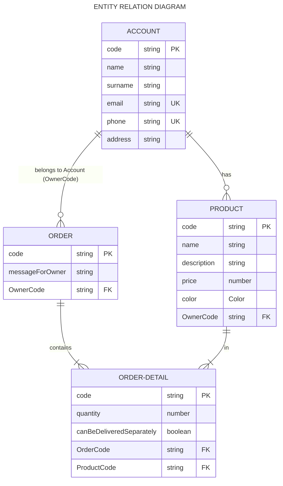

# backend-libs-entities

This library was generated with [Nx](https://nx.dev).

## Building

Run `nx build backend-libs-entities` to build the library.

## Architecture

```mermaid

---
title: ENTITY RELATION DIAGRAM
---

erDiagram
    ACCOUNT ||--o{ ORDER : "belongs to Account (OwnerCode)"
    ACCOUNT ||--o{ PRODUCT : has
    ACCOUNT {
        code string PK
        name string
        surname string
        email string UK
        phone string UK
        address string
    }
    ORDER ||--|{ ORDER-DETAIL : contains
    ORDER {
        code string PK
        messageForOwner string
        OwnerCode string FK
    }
    PRODUCT ||--|{ ORDER-DETAIL : in
    PRODUCT {
        code string PK
        name string
        description string
        price number
        color Color
        OwnerCode string FK
    }
    ORDER-DETAIL {
        code string PK
        quantity number
        canBeDeliveredSeparately boolean
        OrderCode string FK
        ProductCode string FK
    }


```
