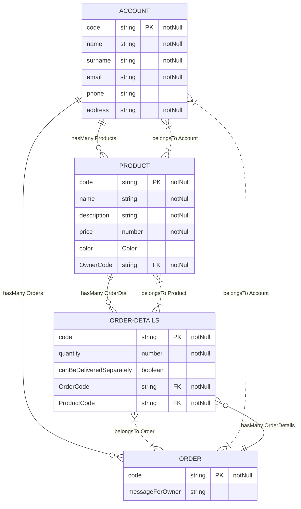

# shared-data-entities

This library was generated with [Nx](https://nx.dev).

## Building

Run `nx build shared-data-entities` to build the library.

```mermaid
erDiagram
    ACCOUNT ||--o{ PRODUCT : "hasMany Products"
    ACCOUNT ||--o{ ORDER : "hasMany Orders"
    ACCOUNT {
        code string PK "notNull"
        name string "notNull"
        surname string "notNull"
        email string "notNull"
        phone string
        address string "notNull"
    }
    PRODUCT }|..|{ ACCOUNT : "belongsTo Account"
    PRODUCT ||--o{ ORDER-DETAILS : "hasMany OrderDts."
    PRODUCT {
        code string PK "notNull"
        name string "notNull"
        description string "notNull"
        price number "notNull"
        color Color
        OwnerCode string FK "notNull"
    }
    ORDER }|..|{ ACCOUNT : "belongsTo Account"
    ORDER ||--o{ ORDER-DETAILS : "hasMany OrderDetails"
    ORDER {
        code string PK "notNull"
        messageForOwner string
    }
    ORDER-DETAILS }|..|{ ORDER : "belongsTo Order"
    ORDER-DETAILS }|..|{ PRODUCT : "belongsTo Product"
    ORDER-DETAILS {
        code string PK "notNull"
        quantity number "notNull"
        canBeDeliveredSeparately boolean
        OrderCode string FK "notNull"
        ProductCode string FK "notNull"
    }
```
